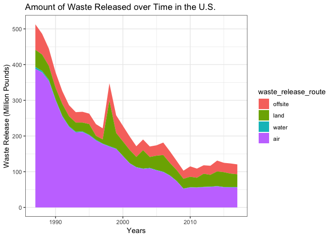
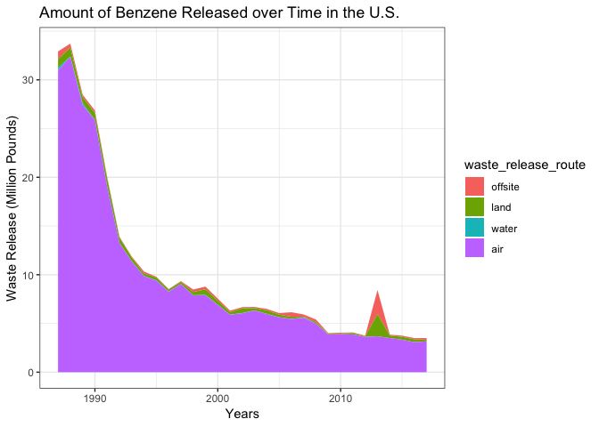
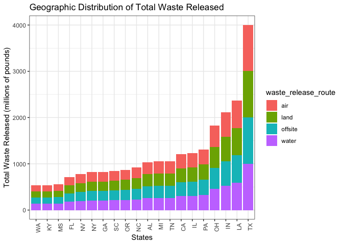
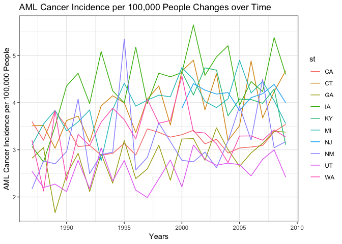
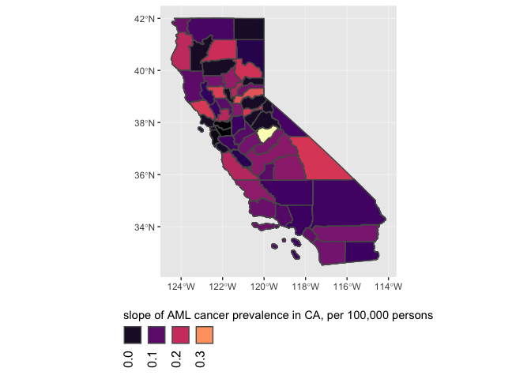
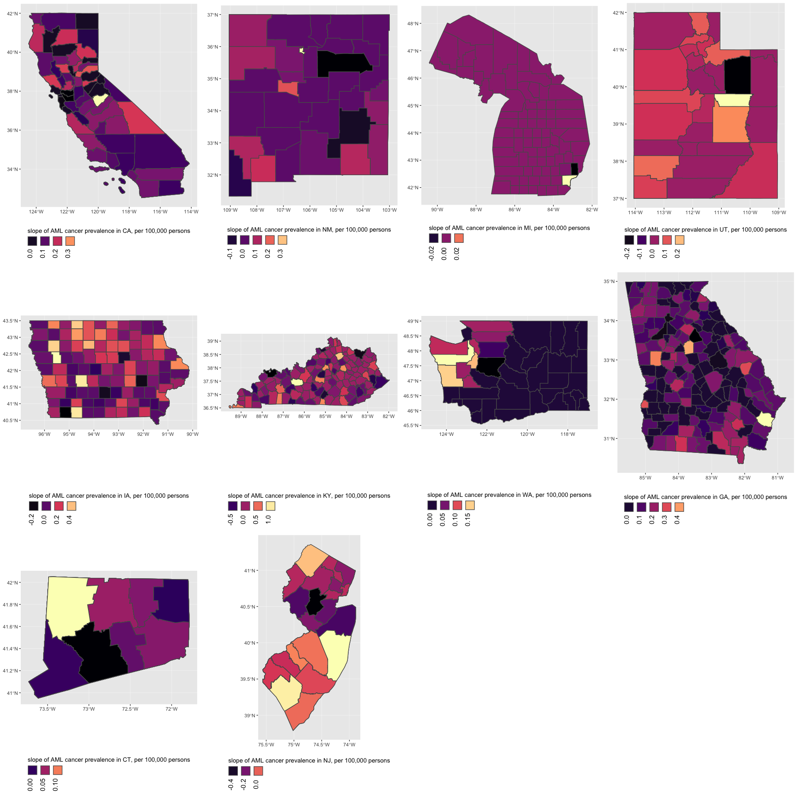
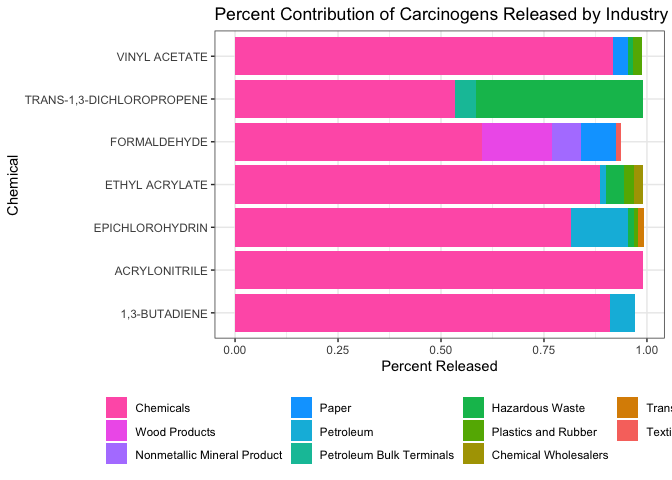

Report
================
James Dalgleish, Joy Hsu, Rachel Tsong, Yishan Wang, Adina Zhang
6 December 2018

Data Access
-----------

Our data can be accessed in this [GitHub repository](https://github.com/toxgisfinalproject/data).

I. Motivation
-------------

It is well known that exposure to certain chemicals can be a causal factor for many cancers, and many of the chemicals released from industry are carcinogenic. For this project, we wanted to know if we could use datasets that are publicly available to see if there is a geographic association between incidences of cancer and amount of toxic waste dumping. We hope our project results can help people understand the importance of reducing the amount of toxic waste dumping and create a cleaner, healthier living environment.

II. Related Work
----------------

Extensive research has been done regarding the carcinogenicity of many toxic chemicals. A research article “Association between Six Environmental Chemicals and Lung Cancer Incidence in the United States” was particularly inspiring because it used publicly available datasets (Toxic Release Inventory and Surveillance, Epidemiology, and End Results) to link environmental waste to cancer. It explained what chemicals that are important determinants in lung cancer development. Based on this research article, we wanted to conduct further research to find out the relationships between major chemical waste exposures and common cancers (including lung cancer).

III. Initial Questions
----------------------

Initially, in our proposal we suggested exploring several lines of inquiry:

-   Toxic waste data
    -   What chemicals are being released? Which ones are carcinogens?
    -   What is the geographic distribution (by county, state) of chemical waste releases?
    -   What are the temporal trends of chemical waste release?
-   Census data
    -   Is there a geographic and/or temporal relationship between socio-economic status and chemical waste releases?
-   Disease data
    -   Is there a geographic and/or temporal relationship between health outcomes (including cancer, asthma, birth outcomes, etc.) and chemical waste releases?

We wanted to begin our project with a broad general idea and then narrow our focus as time went on. One of the first things we focused on was selecting cancer as our main disease outcome. This was in part due to the availability of cancer data and also based on group member interest. Additionally, we looked into scientific literature to help us decide what cancers and chemicals were already shown to be linked, so that we had some guidelines for our analysis. Based on a couple of papers, we decided that we could look at lung cancer and determine which (if any chemicals) were geographically correlated to lung cancer incidence.

Over time, our research questions changed a lot based on the limitations in the datasets that we chose. For example, there is a strong connection between asbestos exposure and mesothelioma, so we thought that it would be interesting to investigate if mesothelioma rates are correlated to places where asbestos is released into the environment. However, mesothelioma was such a rare cancer that there were not enough counties that reported both asbestos release and cases of mesothelioma. Additionally, although we initially wanted to investigate national trends regarding cancer and toxic waste, we were limited by the SEER dataset because there is not data for every state.

Another change that we made was bringing in additional outside sources. We decided to focus on lung cancer as our main outcome, and we knew that smoking prevalence has a significant effect on incidences of lung cancer. With this in mind, after fitting regression models between cancer incidence and chemical release output, we decided to add in smoking prevalence data in order to improve our model. We obtained smoking data from the behavioral risk factor surveillance system.

In the end, our overall guiding questions did not change significantly, though the scope of the project did. Our final project aims to answer the following questions:

-   What chemicals have a significant correlation to lung cancer incidences?

-   What industries are responsible for releasing these chemicals?

-   How has waste released change over time for different states/counties?

-   How has incidences of cancer change over time for the states available in our data set?

IV. Data Sources
----------------

### The Toxic Releases Inventory (TRI)

The Toxic Releases Inventory (TRI) is a dataset compiled by the U.S. Environmental Protection Agency (EPA) and contains comprehensive information describing estimated waste release and transfers of toxic chemicals in the United States between 1987 to present. Following policy passed in 1986, it became required for manufacturing facilities to report their releases of toxic chemicals to the EPA. By making these data public, industries are held accountable for their waste and environmental impact.

### The Surveillance, Epidemiology, and End Results (SEER) Program

The Surveillance, Epidemiology, and End Results (SEER) Program is a dataset compiled by the National Cancer Institute (NCI) and contains information that describes cancer statistics in the United States. They compile information from 17 cancer registries across ten states from 1987 to 2009.

### Census Bureau

The dataset on population of counties and states in the U.S. was compiled by Census Bureau.

### Behavioral Risk Factor Data: Tobacco Use

The dataset on tobacco use was compiled by the Center for Disease Control based on BRFSS Survey Data, for years 1996-2016. BRFSS is a continuous surveillance system that collects information on chronic health conditions and related risk behaviors, in all 50 states and US territories.

V. Data Collection and Cleaning
-------------------------------

-   [SEER data](https://seer.cancer.gov/data/) (Surveillance, Epidemiology, and End Results)

SEER data was obtained by applying for permission for the data (<https://seer.cancer.gov/seertrack/data/request/>) and after a period, we were sent links to self-extracting archives containing textual and binary data of relatively large size. The SEERaBOMB package (from CRAN: <https://cran.r-project.org/web/packages/SEERaBomb/SEERaBomb.pdf>) was used to take the original ASCII text files into RData format. We modified the pickFields function such that it works on current SEER data to make it function.

Following this, we used the maps package to convert the state and county FIPS codes to state and county names and saved the result into an RDS file. Following this, we selected the state name, county name, cancer, state-county fips code, and the year of diagnosis and then summarized the flat initial SEER data frame where every row represented an individual cancer case and converted it into county based sums of patients with a specific cancer in that county. We converted state names to abbreviations.

-   [TRI Data](https://toxmap.nlm.nih.gov/toxmap/download.html) (Toxics Release Inventory)

TRI data that contained lines for individual chemicals released from a single facility on a certain year was pulled in from several large comma separated value files, combined by rows, and summarized similarly such that the total number of released pounds by chemical was obtained for every chemical in every county.

This tidy dataset was then formed by performing an inner join by county, state, and year for aggregated cancer data to aggregated TRI facility data.

-   [Census Data](https://www.census.gov/support/USACdataDownloads.html)

Population estimates for each county by year were then obtained from the census bureau website (<https://www.census.gov/support/USACdataDownloads.html>) by the following process: Census codes were obtained from the master datasheet (“Mastdata.xls”) for every year from 1979 to 2009. Utilizing a custom function to read all the sheets from an excel file into a list of sheets, several individual excel files were read in after conversion to xlsx format (INC01 to INC03, PVY01 to PVY02, PST01 and PST02, and IPE01). Area name and fips were extracted along with the columns for income and population estimates for the respective year. These columns were converted from wide to long format and census codes naming the original columns were resolved to years. Two dataframes resulted from this, one for median household income by county and one for population estimates. Given time constraints, we aimed to use the population estimates and merged them to the aggregated seer and tri facility data. Population data was then joined to the joined cancer-tri data by state-county fips code and year.

-   [BRFSS](https://catalog.data.gov/dataset/behavioral-risk-factor-data-tobacco-use-2010-and-prior-2963a/resource/5943fbb9-676c-460c-906f-5003af4844d4) (BRFSS Data: Tobacco Use 2010 and Prior)

Data cleaning process please see VII. Additional Analysis on Lung Cancer Incidence.

-   [BRFSS](https://catalog.data.gov/dataset/behavioral-risk-factor-data-tobacco-use-2011-to-present-c68e1) (BRFSS Data: Tobacco Use 2011 to Present)

Data cleaning process please see VII. Additional Analysis on Lung Cancer Incidence.

VI. Exploratory Analysis
------------------------

Based off of our outside research, we identified some combinations of chemicals and cancers we would be interested in investigating. Benzene and acute myeloid leukemia have been strongly linked in the literature. Lung cancers have also been linked with several carcinogens in our dataset include formaldehyde, acrylonitrile, 1,3-butadiene, and several others. Throughout our exploratory analysis, we provide visualizations and summaries including both general trends and specific trends to our cancers and chemicals of interest. In our summaries, the TRI dataset has been filtered to only include carcinogens.

### TRI Data

The amount of waste released from industrial factories is categorized into the separate release routes in order to better evaluate the waste management system as well as gauge environmental and human impact. From the literature and TRI website, most analysis is categorized between onsite and offsite waste. Offsite waste is the waste transported away for processing and disposal at waste management facilities or reused for other industrial processes. Onsite waste is the waste released directly from the factory into the environment. This category is further divided into waste released into the air, water, or land. We are most interested in evaluating these routes as these are the paths that most directly impact the health of individuals living near industrial facilities.

#### Common Carcinogens Released

We wanted to first identify which chemicals we would have the most information for further analysis. Some common ones we found included notable carcinogens: styrene, formaldehyde, lead, benzene, and asbestos.

``` r
# Group by common carcinogens and summarize counts
tri_df = readRDS("./data/tri_df.rds")
cancer_pop_df = readRDS("./data/cancer_county_chem_pop.rds")
cancer_pop_df
```

    ## # A tibble: 1,136,431 x 9
    ## # Groups:   chemical, st, county [3,056]
    ##    chemical st    county  year total_rel_summ cancer     n pop_est
    ##    <chr>    <chr> <chr>  <int>          <dbl> <fct>  <int>   <dbl>
    ##  1 ASBESTO… ca    kings   2000        6488714 ALL        3  129774
    ##  2 ASBESTO… ca    kings   2000        6488714 AML        4  129774
    ##  3 ASBESTO… ca    kings   2000        6488714 bladd…    13  129774
    ##  4 ASBESTO… ca    kings   2000        6488714 brain      6  129774
    ##  5 ASBESTO… ca    kings   2000        6488714 breast    63  129774
    ##  6 ASBESTO… ca    kings   2000        6488714 breas…    10  129774
    ##  7 ASBESTO… ca    kings   2000        6488714 cervix     8  129774
    ##  8 ASBESTO… ca    kings   2000        6488714 CLL        3  129774
    ##  9 ASBESTO… ca    kings   2000        6488714 CML        1  129774
    ## 10 ASBESTO… ca    kings   2000        6488714 colon     17  129774
    ## # ... with 1,136,421 more rows, and 1 more variable: prevalence <dbl>

``` r
tri_df %>% 
  group_by(chemical) %>% 
  summarize(onsite_release_total = sum(on_site_release_total)) %>% 
  arrange(-onsite_release_total)
```

    ## # A tibble: 166 x 2
    ##    chemical            onsite_release_total
    ##    <chr>                              <dbl>
    ##  1 STYRENE                      1183451999.
    ##  2 DICHLOROMETHANE              1166320724.
    ##  3 FORMALDEHYDE                  632933364.
    ##  4 TRICHLOROETHYLENE             501959108.
    ##  5 ACETALDEHYDE                  357033097.
    ##  6 LEAD                          321198063.
    ##  7 BENZENE                       318018516.
    ##  8 ASBESTOS (FRIABLE)            285320235.
    ##  9 TETRACHLOROETHYLENE           239930034.
    ## 10 ACRYLONITRILE                 237024057.
    ## # ... with 156 more rows

#### Amount of Waste Released over Time

##### Amount of Waste Released over Time in the U.S.

``` r
# Group by year and sum waste releases for each year
# Tidy data by combining waste release routes into one variable
# Plot stacked yearly release for the U.S.
stacked_yearly_release_all = tri_df %>% 
  group_by(year) %>% 
  summarize(air = round(sum(air_onsite_release)/1000000, digits = 3),
            water = round(sum(water_onsite_release)/1000000, digits = 3),
            land = round(sum(land_onsite_release, na.rm = TRUE)/1000000, digits = 3),
            offsite = round(sum(off_site_release_total)/1000000, digits = 3),
            total_release = round(sum(total_releases)/1000000, digits = 3)) %>% 
  arrange(-total_release) %>% 
  gather(key = waste_release_route, value = release, air:offsite) %>% 
  mutate(waste_release_route = fct_relevel(waste_release_route, "offsite","land", "water", "air"))

ggplot(stacked_yearly_release_all, aes(x = year, y = release, fill = waste_release_route)) +
  geom_area(position = 'stack') + 
  viridis::scale_color_viridis() + 
  labs(
    title = "Amount of Waste Released over Time in the U.S.",
    y = "Waste Release (Million Pounds)",
    x = "Years"
  ) +
  theme_bw()
```



##### Amount of Benzene Released over Time in the U.S.

``` r
# Group by year and filter for Benzene
# Sum waste releases for each year
# Tidy data by combining waste release routes into one variable
# Plot stacked yearly release for Benzene
stacked_yearly_release_benzene = tri_df %>% 
  filter(chemical == "BENZENE") %>% 
  group_by(year) %>% 
  summarize(air = round(sum(air_onsite_release)/1000000, digits = 3),
            water = round(sum(water_onsite_release)/1000000, digits = 3),
            land = round(sum(land_onsite_release, na.rm = TRUE)/1000000, digits = 3),
            offsite = round(sum(off_site_release_total)/1000000, digits = 3),
            total_release = round(sum(total_releases)/1000000, digits = 3)) %>% 
  arrange(-total_release) %>% 
  gather(key = waste_release_route, value = release, air:offsite) %>% 
  mutate(waste_release_route = fct_relevel(waste_release_route, "offsite","land", "water", "air"))

ggplot(stacked_yearly_release_benzene, aes(x = year, y = release, fill = waste_release_route)) +
  geom_area(position = 'stack') + 
  viridis::scale_color_viridis() + 
  labs(
    title = "Amount of Benzene Released over Time in the U.S.",
    y = "Waste Release (Million Pounds)",
    x = "Years"
  ) +
  theme_bw()
```



In general, carcinogenic waste has decreased between 1987 to 2017, reflecting strongly on the improvements to waste management policy and practices. Most carcinogenic waste is released through the air. It would seem that most exposure to industrial chemicals for humans would occur through the air and there might be strong information to investigate lung cancer.

#### Geographic Distribution of Waste

Based off of this barplot, the top five states that produce the most carcinogenic waste are Texas, Louisiana, Indiana, Ohio, and Pennsylvania. These results make sense as most manufacturing in America occurs in these states.

``` r
# Group by state and sum waste releases for each state
# Tidy data by combining waste release routes into one variable
# Plot stacked bar chart across states
tri_df %>% 
  group_by(state) %>% 
  summarize(air = round(sum(air_onsite_release)/1000000, digits = 3),
            water = round(sum(water_onsite_release)/1000000, digits = 3),
            land = round(sum(land_onsite_release, na.rm = TRUE)/1000000, digits = 3),
            offsite = round(sum(off_site_release_total)/1000000, digits = 3),
            total_release = round(sum(total_releases)/1000000, digits = 3)) %>% 
  arrange(-total_release) %>% 
  top_n(20) %>% 
  gather(key = waste_release_route, value = release, air:offsite) %>% 
  ggplot(aes(x = reorder(state, total_release), 
             y = total_release, 
             fill = waste_release_route)) + 
  geom_bar(stat = "identity") + 
  viridis::scale_color_viridis() + 
  labs(
    title = "Geographic Distribution of Total Waste Released",
    x = "States",
    y = "Total Waste Released (millions of pounds)"
  ) + 
  theme_bw() + 
  theme(axis.text.x = element_text(angle = 90, hjust = 1))
```



Based off of this barplot, the top five states that produce the most carcinogenic waste are Texas, Louisiana, Indiana, Ohio, and Pennsylvania.

#### Top Industries that Produce the Most Carcinogenic Waste

##### Top Industries that Produce the Most Carcinogenic Waste in the U.S.

``` r
# Group by industry and summarize by sum of total releases
top_industry_waste = tri_df %>% 
  group_by(industry_sector) %>% 
  summarize(release_total = round(sum(total_releases)/1000000, digits = 3)) %>% 
  arrange(-release_total) %>%
  top_n(12)

colnames(top_industry_waste)[colnames(top_industry_waste) == "release_total"] = "release_total (in million)" 

top_industry_waste %>% 
  knitr::kable()
```

| industry\_sector            |  release\_total (in million)|
|:----------------------------|----------------------------:|
| Chemicals                   |                     2349.381|
| Plastics and Rubber         |                     1020.344|
| Hazardous Waste             |                      736.635|
| Transportation Equipment    |                      704.540|
| Primary Metals              |                      609.774|
| Paper                       |                      455.896|
| Fabricated Metals           |                      378.973|
| Metal Mining                |                      274.236|
| Wood Products               |                      190.208|
| Petroleum                   |                      172.828|
| Machinery                   |                      166.335|
| Nonmetallic Mineral Product |                      117.732|

##### Top Industries that Produce the Most Benzene Waste in the U.S.

``` r
# Filter for Benzene
# Group by industry and summarize by sum of total releases
top_industry_benzene = tri_df %>% 
  filter(chemical == "BENZENE") %>% 
  group_by(industry_sector) %>% 
  summarize(release_total = round(sum(total_releases)/1000000, digits = 3)) %>% 
  arrange(-release_total) %>% 
  top_n(5)

colnames(top_industry_benzene)[colnames(top_industry_benzene) == "release_total"] = "release_total (in million)" 

top_industry_benzene %>% 
  knitr::kable()
```

| industry\_sector            |  release\_total (in million)|
|:----------------------------|----------------------------:|
| Chemicals                   |                      110.318|
| Petroleum                   |                      107.464|
| Primary Metals              |                       69.512|
| Petroleum Bulk Terminals    |                       10.748|
| Nonmetallic Mineral Product |                        6.277|

### SEER Data

Due to limited information on cancer incidence rates in our dataset, we are only able to report the data from ten states.

#### Cancer Incidence over Time

##### Explore AML Cancer Incidence Changes over Time

``` r
# Filter for AML cancer and group by year and state
# Recalculate cancer incidence by state
# Plot cancer incidence over year, color by state
cancer_yearly = cancer_pop_df %>% 
  filter(cancer == "AML") %>% 
  group_by(year, st) %>% 
  summarize(new_cases = sum(n),
            pop_est = sum(pop_est)) %>% 
  mutate(pop_est_thousands = pop_est/100000,
         incidence = new_cases/pop_est_thousands,
         st = toupper(st))

cancer_yearly %>% 
  ggplot(aes(x = year, y = incidence, color = st)) + 
  geom_line() + 
  labs(
    title = "AML Cancer Incidence per 100,000 People Changes over Time",
    x = "Years",
    y = "AML Cancer Incidence per 100,000 People"
  ) + 
  theme_bw()
```



##### AML Slopes in California

To view the trends over time, we'll show a plot of the slope estimates of the regression model with cancer incidence over time for the ten states available with seer data during the years 1987-2009. Positive slope estimates correspond to an increase in cancer incidence (number of cases per 100,000 persons) while negative slopes indicate a decreasing trend. We'll show AML slopes in california as an example and leave it to the user to explore the leaflet application we have developed.

``` r
cancer_slope_plot <- function(spec_state, spec_cancer, print = TRUE)
{    
      if (!exists("cancer_pop_df")) {
      cancer_pop_df = readRDS("./data/cancer_county_chem_pop.rds") %>% 
      mutate(incidence = n/pop_est) }
      options(tigris_class = "sf")
      state_sf <- tigris::counties(state = spec_state) %>%
      janitor::clean_names() %>%
      dplyr::mutate(name = tolower(name)) %>% 
      select(-metdivfp,-csafp,-cbsafp)
      
      cancer_state_subset <- cancer_pop_df %>% 
      filter(cancer == spec_cancer & st == spec_state) %>% 
      select(prevalence,year,cancer) %>% 
      spread(year,prevalence) %>% 
      ungroup() %>% 
      select(-chemical,-st,-cancer) %>% 
      distinct() %>% 
      replace_na(list(prevalence = 0)) %>% 
      as.data.frame()
      
      cancer_sf_joined <- state_sf %>%
      left_join(cancer_state_subset, by = c("name" = "county"))
      
      first_year <- intersect(1987:2009,
      names(cancer_sf_joined)) %>% 
      min()
      
      last_year <- intersect(1987:2009,
      names(cancer_sf_joined)) %>% 
      max()
      
      cancer_sf_gathered <- cancer_sf_joined %>%
      gather(key = year, value = prevalence, first_year:last_year)
      
      cancer_lm <- cancer_sf_gathered %>%
      replace_na(list(prevalence = 0)) %>%
      mutate(year = as.numeric(year)) %>%
      group_by(name) %>%
      mutate(prev_kurt = e1071::kurtosis(prevalence)) %>%
      nest() %>%
      mutate(county_prev_lm = purrr::map(data, ~lm(formula = prevalence ~ year, data = .x)) ) %>%
      mutate(lm_tidy = purrr::map(county_prev_lm, broom::tidy, conf.int = TRUE)) %>%
      select(-data, -county_prev_lm) %>%
      unnest() %>%
      filter(term == "year")
      
      cancer_sf_joined_lm <- cancer_sf_joined %>% 
      right_join(cancer_lm, by = "name")
      
      slope_plot <- ggplot(data = cancer_sf_joined_lm,
      aes(fill = estimate*1e5, group = name)) +
      geom_sf() +
      scale_fill_viridis_c(option = "magma",
      guide = guide_legend(
        direction = "horizontal",
        title.position = "top",
        label.position = "bottom",
        label.hjust = 0.5,
        label.vjust = 1,
        label.theme = element_text(angle = 90)
      )) +
      labs(fill = str_c("slope of ", spec_cancer, " cancer prevalence in ",
      toupper(spec_state), ", per 100,000 persons")) +
      theme(legend.position = "bottom")
      if (print) {
        print(slope_plot)
      }
      return(slope_plot)
}

cancer_slope_plot(spec_state = "ca", spec_cancer = "AML", print = F)
```



Above, we notice that Mariposa County, CA (the only county colored in bright yellow, indicating a high slope estimate) has a high increase in cancer incidence for AML over time and really stands out visually. Although AML is linked with [Benzene exposure](https://www.ncbi.nlm.nih.gov/pubmed/17506065), the releases of benzene do not appear to be explanatory variable as the releases of benzene do not coincide with cancer incidence at the county level (see app), but we might find that there was a statewide increase in 2013 in benzene release [(see Chemical Release Over Time)](jamesdalg.shinyapps.io/seer_dash/). This among other factors may explain the change in cancer incidence.

A look at all 10 states in the study is shown below. This is done by obtaining the list of unique names from the finalized dataset and utilizing the cancer\_slope\_plot function iteratively on all states, then using the patchwork library’s wrap plots to combine the data into a grid with 4 columns of plots.

``` r
all_states <- cancer_pop_df %>% 
  pull(st) %>% 
  unique()
ggplist_aml <- all_states %>% 
  purrr::map(.x = ., .f = cancer_slope_plot, spec_cancer = "AML", print = F)

library(patchwork)
patchwork::wrap_plots(ggplist_aml) + plot_layout(ncol = 4)
```



We also find that in New Jersey, Ocean County and Cumberland County has a positive trend of AML cases across time. Although benzene doesn’t have a direct geographical relationship, further exploration of chemicals may turn up a few leads.

### TRI-SEER Dashboard

In the exploratory dashboard, we present several interactive plots that allow for users to explore industrial waste release and cancer incidences across different states and counties. These plots are derived from our exploratory analysis and take advantage of the Shiny web app interactivity that gives the user control to choose specific chemicals and cancers they might be interested in. Due to limiting cancer incidence data, we only include the 10 states we have information for on our dashboard. Find our dashboard [here](https://jamesdalg.shinyapps.io/seer_dash/).

A choropleth map in the first dashboard tab displays change in cancer incidence over time at the county level. The slope measurement represents the estimated change in cancer incidence per 100,000 individuals from 1987 to 2009. An additional choropleth map shows the density of waste release by county area. Individual waste release sites can be seen from the blue markers.

Cancer incidence over time is visualized in a spaghetti plot representing ten states in the US. Users can select different cancers they are interested in and visualize time trends. A second plot derived from the TRI dataset shows industrial waste released over time and can be filtered to examine different chemicals in different states. The stacked line plot shows the contribution of different waste release routes (air, water, land, offsite) to the total sum of waste released.

VII. Additional Analysis on Lung Cancer Incidence
-------------------------------------------------

### Data Processing

To explore relationships between chemical release and lung cancer incidence, we joined datasets for Toxic Release Inventory, SEER, income data from US Census, and tobacco use from BRFSS Surveys. Since we were most interested in exposure-response relationships, we excluded chemicals reported less than 10 times, either in separate years or separate counties. For cancer incidence measures, we excluded counties with a population under 50,000, since small population sizes may lack the statistical power to detect effects on cancer risk. Next, we log-transformed quantity of chemical release into ln(pound) units to improve linearity of the relationship between chemical release and cancer incidence. Lastly, we linked smoking prevalence from the BRFSS dataset for years 1996 to 2016.

``` r
# import summarized cancer & toxicity datafile
# exclude values where no chemical was reported
# exclude populations under 50,000
cancer_county_chem_pop = readRDS("./data/cancer_county_chem_pop.rds") %>% 
  janitor::clean_names() %>% 
  ungroup() %>% 
  filter(
    total_rel_summ != 0,
    pop_est > 50000) %>% 
  mutate(
    chemical = purrr::map(chemical, tolower),
    chemical = str_replace(chemical, " ", "_"),
    total_rel_log = log(total_rel_summ))
```

Filter for chemicals reported at least 10 times and convert each chemical to separate variable

``` r
# lung_chemical = shortlist of chemicals reported at least 10 times for lung cancer, 62 chemicals met criteria. 
lung_chemical = cancer_county_chem_pop %>% 
  filter(cancer == "lung") %>% 
  group_by(chemical) %>% 
  summarise(freq = n()) %>% 
  arrange(freq) %>% 
  filter(freq >= 10) %>% 
  dplyr::select(chemical)

# lung_chemical2 = filter dataset for only lung cancer
lung_chemical2 = cancer_county_chem_pop %>% 
  filter(cancer == "lung")

# cancer_chem_lung = inner join of 2 datasets above: lung_chemical + lung_chemical2  
cancer_chem_lung = dplyr::inner_join(lung_chemical, lung_chemical2, by = "chemical")

# Spread function with each chemical release as separate variable, total release as value
lung_spread = cancer_chem_lung %>% 
  dplyr::select(-total_rel_summ) %>% 
  spread(key = chemical, value = total_rel_log) %>% 
  janitor::clean_names()
```

Link Median Income from Census Data

``` r
# load census dataset for median income
census_income_df = readRDS("./data/census_income_pop_tidy.rds") %>% 
  janitor::clean_names() %>% 
  separate(area_name, into = c("county", "st"), sep = ",") %>% 
  filter(st != "NA") %>% 
  map_df(tolower) %>% 
  dplyr::select(year = year_inc, st, county, med_income) %>% 
  mutate(
    year = as.integer(year),
    st = str_replace(st, " ", ""))

# join income and lung cancer data
# mutate incidence to cases per 100 thousand scale
lung_spread_income = dplyr::left_join(lung_spread, census_income_df, by = c("county" = "county", "year" = "year", "st" = "st")) %>% 
  dplyr::select(med_income, everything()) %>%
  arrange(desc(med_income)) %>% 
  mutate(
    med_income = as.numeric(med_income)/1000,
    incidence_100k = round((prevalence * 100000), digits = 0)) %>% 
  dplyr::select(incidence_100k, everything())
```

Link Smoking Prevalence Data from BRFSS

``` r
# read BRFSS Data from 2010 onwards
# calculate proportion of prior or current smokers by subtracting proportion of "Never" Smokers
tobacco_2010_present = read_csv(file = "./data/BRFD_tobacco_2010_present.csv") %>% 
  filter(Response == "Never") %>% 
  dplyr::select(year = "YEAR", st = "LocationAbbr", response = "Response", percent_never = "Data_Value") %>%
  janitor::clean_names() %>% 
  mutate(percent_smoke = as.numeric(100 - percent_never),
         st = tolower(st),
         year = as.numeric(year)) %>% 
  dplyr::select(year, st, percent_smoke)
  
# read BRFSS Data from 2010 and prior
tobacco_2010_prior = read_csv(file = "./data/BRFD_tobacco_2010_prior.csv") %>% 
  filter(Response == "Never") %>% 
  dplyr::select(year = "YEAR", st = "LocationAbbr", response = "Response", percent_never = "Data_Value") %>%
  janitor::clean_names() %>% 
  mutate(percent_smoke = as.numeric(100 - percent_never),
         st = tolower(st),
         year = as.numeric(year)) %>% 
  dplyr::select(year, st, percent_smoke)


tobacco = bind_rows(tobacco_2010_present, tobacco_2010_prior)

# join smoking prevalence data with main dataset
lung_income_tobacco = left_join(lung_spread_income, tobacco, by = c("year" = "year", "st" = "st")) %>%
  dplyr::select(percent_smoke, everything())
```

### Regression Models on Lung Cancer Incidence

Lung cancer is the leading cause of cancer deaths in the United States. While previous research has demonstrated a clear association between tobacco use and lung cancer, many new cases of lung cancer arise amongst non-smokers. We hypothesized that proximity to chemical waste release may increase the risk for lung cancer. Furthermore, proximity may increase exposure to airborne waste release.

We investigated the relationship between chemical release and lung cancer incidence, at the county level, for seven known carcinogens. Linear regression models were fitted with lung cancer incidence (per 100,000 individuals per year) as the main response and chemical release (log-pounds, by year) as the main effect. We adjusted for two potential confounders, median income\* as a proxy for socioeconomic status and prevalence of current or previous smokers\*\*. Based on our findings, we conclude that acrylonitrile, epichlorohydrin, ethyl-acrylate, formaldehyde, trans-1,3-dichloropropene, 1,3-butadiene release are significant predictors of lung cancer incidence (p-value &lt; 0.05). In our analysis, median income and smoking prevalence were not significant confounders for epichlorohydrin and trans-1,3-dichloropropene release.

Adjusting for median income, vinyl-acetate release approaches significance (p-value = 0.07) as a predictor of lung cancer incidence. In separate analyses, we find that smoking prevalence and vinyl acetate are independent predictors of lung cancer incidence. Furthermore, vinyl acetate release and smoking prevalence are correlated to an extent that is similar to the relationship between vinyl acetate and lung cancer incidence. Together in multiple linear regression model, both are not significant predictors, suggesting that these two predictors may be redundant and accounting for similar portions of the random errors in the model. If these are redundant variables, we might conclude that there is some relationship that makes the variables non-independent in nature. Indeed, this may be the case: In a [mass spectrometry analysis of cigarette data](https://www.ncbi.nlm.nih.gov/pubmed/12433113), it was found that vinyl acetate is a component of cigarette smoke. Therefore, we removed smoking prevalence as a covariate from our model.

\* median income (in thousands) was adjusted for at the county level, by year. \*\* percent of current/previous smokers was adjusted for at the state level, by year.

**1. Formaldehyde**

**Model 1 (adjusted *R*<sup>2</sup>: 0.21, p-value: &lt; 0.05):** Lung Cancer Incidence = 17.81 + 1.40 \* ln(pounds formaldehyde release) + 1.15 \* (percent current/previous smokers) - 2.77e-7 \* (median income)

For every ln(pound) increase in formaldehyde release, we expect 1.4 additional cases of of lung cancer per 100,000 persons (p-value &lt; 0.01), adjusting for smoking prevalence and median income.

``` r
# Fit for formaldehyde
fit_formaldehyde = lung_income_tobacco %>% 
  lm(incidence_100k ~ formaldehyde + percent_smoke + med_income, data = .) 

chem_1 = summary(fit_formaldehyde) %>% 
  broom::tidy() %>% 
  filter(term == "formaldehyde")

summary(fit_formaldehyde) %>% 
  broom::tidy() %>% knitr::kable()
```

| term           |    estimate|  std.error|  statistic|   p.value|
|:---------------|-----------:|----------:|----------:|---------:|
| (Intercept)    |  17.8075791|  4.1867663|   4.253301|  2.22e-05|
| formaldehyde   |   1.4010217|  0.1924513|   7.279876|  0.00e+00|
| percent\_smoke |   1.1523015|  0.0706391|  16.312523|  0.00e+00|
| med\_income    |  -0.2776292|  0.0395100|  -7.026816|  0.00e+00|

**2. acrylonitrile**

**Model 2 (adjusted *R*<sup>2</sup>: 0.29, p-value: &lt; 0.05):** Lung Cancer Incidence = 24.37 + 4.09 \* ln(pounds acrylonitrile release) + 8.23e-01 \* (percent current/previous smokers) - 0.18 \* (median income)

For every ln(pound) increase in formaldehyde release, we expect 4.09 additional cases of of lung cancer per 100,000 persons (p-value &lt; 0.01), adjusting for smoking prevalence and median income.

``` r
# Fit for acrylonitrile
fit_acrylonitrile = lung_income_tobacco %>% 
  lm(incidence_100k ~ acrylonitrile + percent_smoke + med_income, data = .) 

chem_2 = summary(fit_acrylonitrile) %>% 
  broom::tidy() %>%
  filter(term == "acrylonitrile")

summary(fit_acrylonitrile) %>% 
  broom::tidy() %>% knitr::kable()
```

| term           |    estimate|   std.error|  statistic|    p.value|
|:---------------|-----------:|-----------:|----------:|----------:|
| (Intercept)    |  24.3663931|  11.3766476|   2.141790|  0.0327664|
| acrylonitrile  |   4.0944236|   0.5693109|   7.191894|  0.0000000|
| percent\_smoke |   0.8232187|   0.1873149|   4.394838|  0.0000140|
| med\_income    |  -0.1797664|   0.1110915|  -1.618182|  0.1063498|

**3. 1,3-butadiene**

**Model 3 (adjusted *R*<sup>2</sup>: 0.41, p-value: &lt; 0.05):** Lung Cancer Incidence = 8.32 + 2.24 \* ln(pounds 1,3-butadiene release) + 1.56 \* (percent current/previous smokers) - 0.39 \* (median income)

For every ln(pound) increase in 1,3-butadiene release, we expect 2.24 additional cases of of lung cancer per 100,000 persons (p-value &lt; 0.01), adjusting for smoking prevalence and median income.

``` r
# Fit for x1_3_butadiene
fit_butadiene = lung_income_tobacco %>% 
  lm(incidence_100k ~ x1_3_butadiene + percent_smoke + med_income, data = .) 

chem_3 = summary(fit_butadiene) %>% 
  broom::tidy() %>% 
  filter(term == "x1_3_butadiene") %>% 
  mutate(term = str_replace(term, "x1_3_butadiene", "1,3-butadiene"))

summary(fit_butadiene) %>% 
  broom::tidy() %>% knitr::kable()
```

| term             |    estimate|  std.error|  statistic|    p.value|
|:-----------------|-----------:|----------:|----------:|----------:|
| (Intercept)      |   8.3154044|  8.1476253|   1.020592|  0.3078187|
| x1\_3\_butadiene |   2.2447643|  0.3815991|   5.882520|  0.0000000|
| percent\_smoke   |   1.5632049|  0.1062535|  14.712025|  0.0000000|
| med\_income      |  -0.3894833|  0.0926827|  -4.202328|  0.0000300|

**4. epichlorohydrin**

**Model 4 (adjusted *R*<sup>2</sup>: 0.15, p-value: &lt; 0.05):** Lung Cancer Incidence = 59.58 + 2.18 \* ln(pounds epichlorohydrin release)

For every ln(pound) increase in epichlorohydrin release, we expect 2.18 additional cases of of lung cancer per 100,000 persons (p-value &lt; 0.01).

``` r
# Fit for epichlorohydrin
fit_epichlorohydrin = lung_income_tobacco %>% 
  lm(incidence_100k ~ epichlorohydrin, data = .) 

chem_4 = summary(fit_epichlorohydrin) %>% 
  broom::tidy() %>% 
  filter(term == "epichlorohydrin")

summary(fit_epichlorohydrin) %>% 
  broom::tidy() %>% knitr::kable()
```

| term            |   estimate|  std.error|  statistic|  p.value|
|:----------------|----------:|----------:|----------:|--------:|
| (Intercept)     |  59.584501|  2.0377595|   29.24020|        0|
| epichlorohydrin |   2.181459|  0.3259548|    6.69252|        0|

**5. vinyl-acetate**

**Model 5 (adjusted *R*<sup>2</sup>: 0.20, p-value: &lt; 0.05):** Lung Cancer Incidence = 105 + 0.61 \* ln(pounds vinyl-acetate release) - 0.79 \* (median income)

In a regression model, vinyl-acetate release approaches significance (p-value = 0.07) as a predictor of lung cancer incidence, adjusting for median income. For every ln(pound) increase in vinyl-acetate release, we expect 0.69 additional cases of of lung cancer per 100,000 persons (p-value &lt; 0.01).

``` r
# Fit for vinyl_acetate
fit_vinyl_acetate = lung_income_tobacco %>% 
  lm(incidence_100k ~ vinyl_acetate + med_income, data = .) 

chem_5 = summary(fit_vinyl_acetate) %>% 
  broom::tidy() %>% 
  filter(term == "vinyl_acetate") %>% 
  mutate(term = str_replace(term, "vinyl_acetate", "vinyl-acetate"))

summary(fit_vinyl_acetate) %>% 
  broom::tidy() %>% knitr::kable()
```

| term           |     estimate|  std.error|   statistic|    p.value|
|:---------------|------------:|----------:|-----------:|----------:|
| (Intercept)    |  105.4291723|  4.8277756|   21.838043|  0.0000000|
| vinyl\_acetate |    0.6085737|  0.3341701|    1.821149|  0.0690524|
| med\_income    |   -0.7938396|  0.0682236|  -11.635854|  0.0000000|

**6. ethyl-acrylate**

**Model 6 (adjusted *R*<sup>2</sup>: 0.25, p-value: &lt; 0.05):** Lung Cancer Incidence = 60.63 + 1.24 \* ln(pounds ethyl-acrylate release) + 0.88 \* (percent current/previous smokers) - 0.72 \* (median income)

For every ln(pound) increase in ethyl-acrylate release, we expect 1.24 additional cases of of lung cancer per 100,000 persons (p-value &lt; 0.01), adjusting for smoking prevalence and median income.

``` r
# Fit for ethyl_acrylate
fit_ethyl_acrylate = lung_income_tobacco %>% 
  lm(incidence_100k ~ ethyl_acrylate + percent_smoke + med_income, data = .) 

chem_6 = summary(fit_ethyl_acrylate) %>% 
  broom::tidy() %>% 
  filter(term == "ethyl_acrylate") %>% 
  mutate(term = str_replace(term, "ethyl_acrylate", "ethyl-acrylate"))

summary(fit_ethyl_acrylate) %>% 
  broom::tidy() %>% knitr::kable()
```

| term            |    estimate|  std.error|  statistic|    p.value|
|:----------------|-----------:|----------:|----------:|----------:|
| (Intercept)     |  60.6302865|  8.9376051|   6.783728|  0.0000000|
| ethyl\_acrylate |   1.2382589|  0.4327826|   2.861157|  0.0044601|
| percent\_smoke  |   0.8824776|  0.1655538|   5.330458|  0.0000002|
| med\_income     |  -0.7257167|  0.0912372|  -7.954172|  0.0000000|

**7. trans-1,3-dichloropropene**

**Model 7 (adjusted *R*<sup>2</sup>: 0.90, p-value: &lt; 0.05):** Lung Cancer Incidence = 39.57 + 4.78 \* ln(pounds trans-1,3-dichloropropene release)

Trans-1,3-dichloropropene is an organochlorine compound primarily used in farming as a pesticide, specifically as a preplant fumigant and nematicide. For every ln(pound) increase in trans-1,3-dichloropropene release, we expect 1.24 additional cases of of lung cancer per 100,000 persons (p-value &lt; 0.01).

``` r
# Fit for trans-1,3-dichloropropene
fit_dichloropropene = lung_income_tobacco %>% 
  lm(incidence_100k ~ trans_1_3_dichloropropene, data = .) 

chem_7 = summary(fit_dichloropropene) %>% 
  broom::tidy() %>% 
  filter(term == "trans_1_3_dichloropropene") %>% 
  mutate(term = str_replace(term, "trans_1_3_dichloropropene", "trans-1,3-dichloropropene"))

summary(fit_dichloropropene) %>% 
  broom::tidy() %>% knitr::kable()
```

| term                         |   estimate|  std.error|  statistic|  p.value|
|:-----------------------------|----------:|----------:|----------:|--------:|
| (Intercept)                  |  39.570731|  0.8338682|   47.45442|        0|
| trans\_1\_3\_dichloropropene |   4.778665|  0.2153841|   22.18671|        0|

### Summary Table for Slope Coefficients

The table below shows the estimated slope coefficients for each chemical in our linear models.

``` r
# summary table for beta1 coefficients
beta1_table = bind_rows(chem_1, chem_2, chem_3, chem_4, chem_5, chem_6, chem_7) %>% 
  arrange(term) %>% 
  mutate(
    estimate = round(estimate, digits = 2),
    std.error = round(std.error, digits = 2),
    statistic = round(statistic, digits = 2)) %>% 
  select(chemical = term, "slope estimate" = estimate, everything()) %>% knitr::kable()
beta1_table
```

| chemical                  |  slope estimate|  std.error|  statistic|    p.value|
|:--------------------------|---------------:|----------:|----------:|----------:|
| 1,3-butadiene             |            2.24|       0.38|       5.88|  0.0000000|
| acrylonitrile             |            4.09|       0.57|       7.19|  0.0000000|
| epichlorohydrin           |            2.18|       0.33|       6.69|  0.0000000|
| ethyl-acrylate            |            1.24|       0.43|       2.86|  0.0044601|
| formaldehyde              |            1.40|       0.19|       7.28|  0.0000000|
| trans-1,3-dichloropropene |            4.78|       0.22|      22.19|  0.0000000|
| vinyl-acetate             |            0.61|       0.33|       1.82|  0.0690524|

### Visualization of 7 Chemicals & Lung Cancer Incidence

We created a scatterplot that shows the relationship between lung cancer incidence and the total amount of chemicals released per county per year for the seven chemicals that we found to be significantly correlated to lung cancer incidence.

Please visit our plotly visualization [here.](https://toxgisfinalproject.github.io/toxcancer.github.io/about.html)

``` r
# plotly scatterplot with 7 chemicals 
plotly::plot_ly(data = lung_spread_income, text = ~paste("State: ", st, '<br>County: ', county, '<br>Year: ', year), colors = "Set1") %>%
  add_trace(x = ~acrylonitrile, y = ~incidence_100k, color = I("tomato"), name = 'acrylonitrile', opacity = 0.8) %>% 
  add_trace(x = ~epichlorohydrin, y = ~incidence_100k, color = I("orange"), name = 'epichlorohydrin', opacity = 0.8) %>% 
  add_trace(x = ~ethyl_acrylate, y = ~incidence_100k, color = I("seagreen"), name = 'ethyl_acrylate', opacity = 0.8) %>% 
  add_trace(x = ~formaldehyde, y = ~incidence_100k, color = I("royalblue"), name = 'formaldehyde', opacity = 0.8) %>% 
  add_trace(x = ~trans_1_3_dichloropropene, y = ~incidence_100k, color = I("mediumpurple"), name = 'trans-1,3-dichloropropene', opacity = 0.8) %>% 
  add_trace(x = ~vinyl_acetate, y = ~incidence_100k, color = I("olivedrab"), name = 'vinyl-acetate', opacity = 0.8) %>% 
  add_trace(x = ~x1_3_butadiene, y = ~incidence_100k, color = I("hotpink3"), name = '1,3-butadiene', opacity = 0.8) %>% 
  layout(title = 'Lung Cancer Incidence by Released Waste',
         xaxis = list(title = "Pounds of Annual Released Waste (log-scaled)"),
         yaxis = list(title = "Lung Cancer Incidence per 100 Thousand per Year"))
```

### Industry Contributors

Because we found the seven chemicals above to be correlated to cancer incidences, we wanted to figure out which industries were responsible for the most releases of each chemical. Below is a graph showing the percent contribution of different industries to the total amount released. The chemical industry is by far the largest contributor to most of the carcinogens. Our model suggests that environmental exposure to chemicals released by these industries may contribute to lung cancer incidence.

``` r
lung_chemicals = tri_df %>%
  filter(chemical == "FORMALDEHYDE" | chemical == "ACRYLONITRILE" | chemical == "1,3-BUTADIENE" | chemical == "EPICHLOROHYDRIN" | chemical == "VINYL ACETATE" | chemical == "ETHYL ACRYLATE" | chemical =="TRANS-1,3-DICHLOROPROPENE")

# sum of total amount of chemical released per industry
industry_released = lung_chemicals %>%
  group_by(chemical, industry_sector) %>%
  summarize(total_per_industry = sum(total_releases))

# sum of total amount of chemical released
total_released = lung_chemicals %>%
  group_by(chemical) %>%
  summarize(total_release = sum(total_releases))

# chemicals relating to lung cancer with a new variable showing percent each industry contributes
# filter to not include industries that contribute less than 1% to total released
lung_percent = inner_join(total_released, industry_released) %>%
  mutate(percent_released = total_per_industry/total_release) %>%
  filter(percent_released > .01) 

# visualization showing percent contribution from each industry
lung_percent %>%
  mutate(industry_sector = fct_reorder(industry_sector, percent_released)) %>%
  ggplot(aes(x = chemical, y = percent_released, fill = industry_sector)) +
  geom_bar(stat = "identity") +
  theme_bw() +
  theme(legend.position = "bottom") +
  guides(fill = guide_legend(reverse=TRUE, title = NULL)) +
  coord_flip() +
  labs(x = "Chemical", y = "Percent Released", title = "Percent Contribution of Carcinogens Released by Industry")
```



VIII. Discussion
----------------

One interesting find in the TRI dataset was an overall decrease in the amount of carcinogenic waste released between 1987 and 2017 in the United States. It is comforting to know that waste management practices have improved greatly since the 1980s and will hopefully benefit our nation long term. It would be worthwhile in the future to design a retrospective cohort study to assess whether there is causality between exposures to the large amount of toxic waste in the 1980s and cancer incidence for adults later in life.

As we worked more with the data, it became evident that the process of investigating relationships between known carcinogens and cancer incidence was not as clear as we had hoped. Some limitations came from the scope of our cancer incidence data which only reports information for a few states. For example, we had hypothesized that benzene and AML would show an interesting relationship as we found several papers discussing this association. Furthermore, the TRI dataset contained extensive information on benzene release. However, since AML is already a rare disease, few counties reported both AML incidence and factories that released benzene into the environment. Inferring associations from a linear regression analysis, as originally intended, was not feasible due to insufficient observations.

We identified that most carcinogens in the United States are released through the air so we decided to further investigate the effect of toxic waste on lung cancer. From our regression models, we were able to demonstrate geographic correlation between lung cancer incidence and the quantity of toxic waste release at the county level, after adjusting for income and smoking prevalence. For the seven chemicals we identified, there appears to be a correlation between increase in the cancer incidence for each unit increase in chemical release.

We recognize that there are many contributing factors towards cancer incidence and our analysis on lung cancer is a simple model of a complex disease. There are several confounders such as rural/urban location and population density that were unaccounted. We also don’t propose that these trends happen at the national level as we only have data on ten states. In the future, we would want to adjust for additional confounding variables to better understand the effect of industrial waste on cancer outcomes. Finding more specific measurements of exposure and disease such as age-adjusted cancer incidences or patient’s distance from industrial factories would benefit our analysis as well.

Observers of our project should be careful to not conclude causation from our model and visualizations. These tools are meant to better inform individuals about the environmental hazards in their states. However, we hope that our website and data tools can help researchers to explore new hypotheses or evaluate well-established ones.
