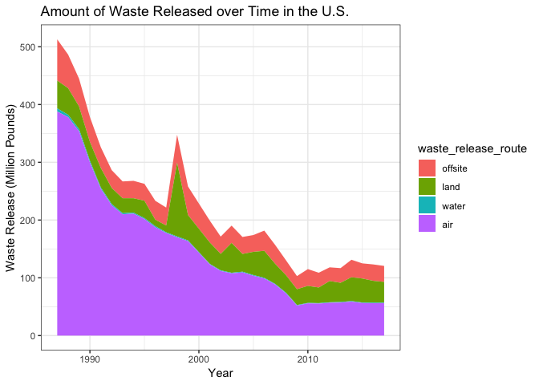
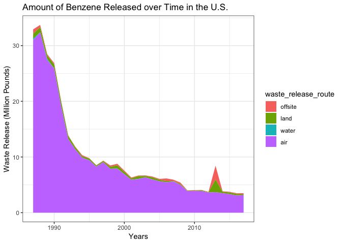
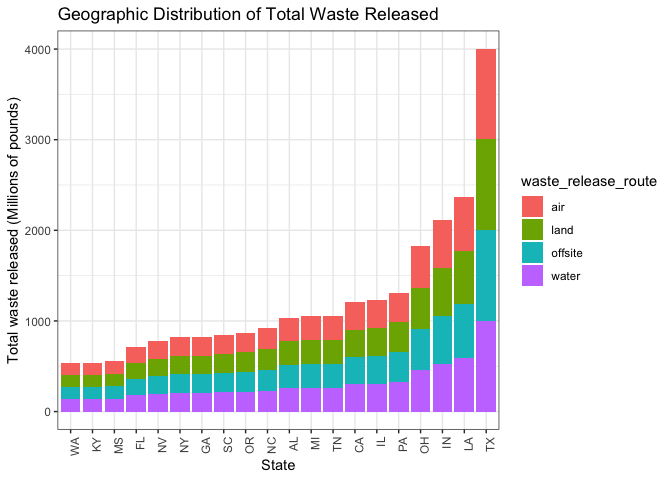
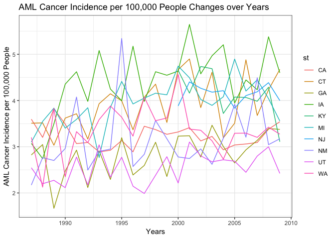

Report
================
James Dalgleish, Joy Hsu, Rachel Tsong, Yishan Wang, Adina Zhang
6 December 2018

Motivation
----------

It is well known that exposure to certain chemicals can be a causal factor for many cancers, and many of the chemicals released from industry are carcinogenic. For this project, we wanted to know if we could use datasets that are publicly available to see if there is a geographic association between incidences of cancer and amount of toxic waste dumping. We hope our project results can help people understand the importance of reducing the amount of toxic waste dumping and create a cleaner, healthier living environment.

Related Work
------------

Extensive research has been done regarding the carcinogenicity of many toxic chemicals. A research article “Association between Six Environmental Chemicals and Lung Cancer Incidence in the United States” was particularly inspiring because it used publicly available datasets (Toxic Release Inventory and Surveillance, Epidemiology, and End Results) to link environmental waste to cancer. It explained what chemicals that are important determinants in lung cancer development. Based on this research article, we wanted to conduct further research to find out the relationships between major chemical waste exposures and common cancers (including lung cancer).

Initial Questions
-----------------

Initially, in our proposal we suggested exploring several lines of inquiry:

-   Toxic waste data
    -   What chemicals are being released? Which ones are carcinogens?
    -   What is the geographic distribution (by county, state) of chemical waste releases?
    -   What are the temporal trends of chemical waste release?
-   Census data
    -   Is there a geographic and/or temporal relationship between socio-economic status and chemical waste releases?
-   Disease data
    -   Is there a geographic and/or temporal relationship between health outcomes (including cancer, asthma, birth outcomes, etc.) and chemical waste releases?

We wanted to begin our project with a broad general idea and then narrow our focus as time went on. One of the first things we focused on was selecting cancer as our main disease outcome. This was in part due to the availability of cancer data and also based on group member interest. Additionally, we looked into scientific literature to help us decide what cancers and chemicals were already shown to be linked, so that we had some guidelines for our analysis. Based on a couple of papers, we decided that we could look at lung cancer and determine which (if any chemicals) were geographically correlated to lung cancer incidence.

Over time, our research questions changed a lot based on the limitations in the datasets that we chose. For example, there is a strong connection between asbestos exposure and mesothelioma, so we thought that it would be interesting to investigate if mesothelioma rates are correlated to places where asbestos is released into the environment. However, mesothelioma was such a rare cancer that there were not enough counties that reported both asbestos release and cases of mesothelioma. Additionally, although we initially wanted to investigate national trends regarding cancer and toxic waste, we were limited by the SEER dataset because there is not data for every state.

Data Sources
------------

### The Toxic Releases Inventory (TRI)

The Toxic Releases Inventory (TRI) is a dataset compiled by the U.S. Environmental Protection Agency (EPA) and contains comprehensive information describing estimated waste release and transfers of toxic chemicals in the United States between 1987 to present. Following policy passed in 1986, it became required for manufacturing facilities to report their releases of toxic chemicals to the EPA. By making these data public, industries are held accountable for their waste and environmental impact.

### The Surveillance, Epidemiology, and End Results (SEER) Program

The Surveillance, Epidemiology, and End Results (SEER) Program is a dataset compiled by the National Cancer Institute (NCI) and contains information that describes cancer statistics in the United States. They compile information from 17 cancer registries across ten states from 1987 to 2009.

Data Collection and Cleaning
----------------------------

-   [SEER data](https://seer.cancer.gov/data/) (Surveillance, Epidemiology, and End Results)

SEER data was obtained by applying for permission for the data (<https://seer.cancer.gov/seertrack/data/request/>) and after a period, we were sent links to self-extracting archives containing textual and binary data of relatively large size. The SEERaBOMB package (from CRAN: <https://cran.r-project.org/web/packages/SEERaBomb/SEERaBomb.pdf>) was used to take the original ASCII text files into RData format. We modified the pickFields function such that it works on current SEER data to make it function.

Following this, we used the maps package to convert the state and county FIPS codes to state and county names and saved the result into an RDS file. Following this, we selected the state name, county name, cancer, state-county fips code, and the year of diagnosis and then summarized the flat initial SEER data frame where every row represented an individual cancer case and converted it into county based sums of patients with a specific cancer in that county. We converted state names to abbreviations.

-   [TRI Data](https://toxmap.nlm.nih.gov/toxmap/download.html) (Toxics Release Inventory)

TRI data that contained lines for individual chemicals released from a single facility on a certain year was pulled in from several large comma separated value files, combined by rows, and summarized similarly such that the total number of released pounds by chemical was obtained for every chemical in every county.

This tidy dataset was then formed by performing an inner join by county, state, and year for aggregated cancer data to aggregated TRI facility data.

-   [Census Data](https://www.census.gov/support/USACdataDownloads.html)

Population estimates for each county by year were then obtained from the census bureau website (<https://www.census.gov/support/USACdataDownloads.html>) by the following process: Census codes were obtained from the master datasheet (“Mastdata.xls”) for every year from 1979 to 2009. Utilizing a custom function to read all the sheets from an excel file into a list of sheets, several individual excel files were read in after conversion to xlsx format (INC01 to INC03, PVY01 to PVY02, PST01 and PST02, and IPE01). Area name and fips were extracted along with the columns for income and population estimates for the respective year. These columns were converted from wide to long format and census codes naming the original columns were resolved to years. Two dataframes resulted from this, one for median household income by county and one for population estimates. Given time constraints, we aimed to use the population estimates and merged them to the aggregated seer and tri facility data. Population data was then joined to the joined cancer-tri data by state-county fips code and year.

Exploratory Analysis
--------------------

Based off of our outside research, we identified some combinations of chemicals and cancers we would be interested in investigating. Benzene and acute myeloid leukemia have been strongly linked in the literature. Lung cancers have also been linked with several carcinogens in our dataset include formaldehyde, acrylonitrile, 1,3-butadiene, and several others. Throughout our exploratory analysis, we provide visualizations and summaries including both general trends and specific trends to our cancers and chemicals of interest. In our summaries, the TRI dataset has been filtered to only include carcinogens.

### TRI data

The amount of waste released from industrial factories is categorized into the separate release routes in order to better evaluate the waste management system as well as gauge environmental and human impact. From the literature and TRI website, most analysis is categorized between onsite and offsite waste. Offsite waste is the waste transported away for processing and disposal at waste management facilities or reused for other industrial processes. Onsite waste is the waste released directly from the factory into the environment. This category is further divided into waste released into the air, water, or land. We are most interested in evaluating these routes as these are the paths that most directly impact the health of individuals living near industrial facilities.

#### Common carcinogens released

``` r
tri_df = read_csv("./data/tri_df_analysis.csv")
```

    ## Parsed with column specification:
    ## cols(
    ##   .default = col_character(),
    ##   year = col_integer(),
    ##   latitude = col_double(),
    ##   longitude = col_double(),
    ##   industry_sector_code = col_integer(),
    ##   primary_naics = col_integer(),
    ##   metal_category = col_integer(),
    ##   air_onsite_release = col_double(),
    ##   water_onsite_release = col_double(),
    ##   land_onsite_release = col_double(),
    ##   on_site_release_total = col_double(),
    ##   potw_total_transfers = col_double(),
    ##   off_site_release_total = col_double(),
    ##   off_site_recycled_total = col_double(),
    ##   off_site_recovery_total = col_integer(),
    ##   off_site_treated_total = col_double(),
    ##   total_releases = col_double(),
    ##   prod_waste_8_1_thru_8_7 = col_integer()
    ## )

    ## See spec(...) for full column specifications.

``` r
cancer_pop_df = readRDS("./data/cancer_county_chem_pop.rds")

tri_df %>% 
  group_by(chemical) %>% 
  summarize(onsite_release_total = sum(on_site_release_total)) %>% 
  arrange(-onsite_release_total) %>%
  knitr::kable()
```

| chemical                                            |  onsite\_release\_total|
|:----------------------------------------------------|-----------------------:|
| STYRENE                                             |            1.183452e+09|
| DICHLOROMETHANE                                     |            1.166321e+09|
| FORMALDEHYDE                                        |            6.329334e+08|
| TRICHLOROETHYLENE                                   |            5.019591e+08|
| ACETALDEHYDE                                        |            3.570331e+08|
| LEAD                                                |            3.211981e+08|
| BENZENE                                             |            3.180185e+08|
| ASBESTOS (FRIABLE)                                  |            2.853202e+08|
| TETRACHLOROETHYLENE                                 |            2.399300e+08|
| ACRYLONITRILE                                       |            2.370241e+08|
| CHLOROFORM                                          |            2.272341e+08|
| ACRYLAMIDE                                          |            1.796703e+08|
| CHROMIUM                                            |            1.476686e+08|
| COBALT COMPOUNDS                                    |            1.354807e+08|
| ARSENIC                                             |            1.337862e+08|
| VINYL ACETATE                                       |            1.187563e+08|
| POLYCHLORINATED BIPHENYLS                           |            8.819710e+07|
| 1,3-BUTADIENE                                       |            8.642994e+07|
| NICKEL                                              |            6.431019e+07|
| 1,2-DICHLOROETHANE                                  |            5.165696e+07|
| ETHYLENE OXIDE                                      |            3.265730e+07|
| ACETAMIDE                                           |            3.147825e+07|
| PROPYLENE OXIDE                                     |            2.993163e+07|
| N,N-DIMETHYLFORMAMIDE                               |            2.737640e+07|
| CARBON TETRACHLORIDE                                |            2.640848e+07|
| VINYL CHLORIDE                                      |            2.514681e+07|
| CREOSOTE                                            |            2.457154e+07|
| POLYCYCLIC AROMATIC COMPOUNDS                       |            2.198131e+07|
| 1,4-DIOXANE                                         |            1.528482e+07|
| CADMIUM                                             |            1.523271e+07|
| ATRAZINE                                            |            1.316943e+07|
| DI(2-ETHYLHEXYL) PHTHALATE                          |            1.284725e+07|
| 1,4-DICHLOROBENZENE                                 |            9.495570e+06|
| EPICHLOROHYDRIN                                     |            9.137044e+06|
| COBALT                                              |            8.820256e+06|
| ETHYL ACRYLATE                                      |            4.504454e+06|
| 4,4'-METHYLENEDIANILINE                             |            3.743413e+06|
| HYDRAZINE SULFATE                                   |            3.303835e+06|
| 2-NITROPROPANE                                      |            3.186937e+06|
| BERYLLIUM                                           |            2.870927e+06|
| CHLOROPHENOLS                                       |            2.506597e+06|
| HYDRAZINE                                           |            2.388273e+06|
| NITRILOTRIACETIC ACID                               |            2.369984e+06|
| 2,4-D                                               |            2.070056e+06|
| URETHANE                                            |            1.792155e+06|
| TETRAFLUOROETHYLENE                                 |            1.700617e+06|
| TETRABROMOBISPHENOL A                               |            1.698653e+06|
| PENTACHLOROPHENOL                                   |            1.564111e+06|
| TOLUENE-2,4-DIISOCYANATE                            |            1.496251e+06|
| TOLUENE-2,6-DIISOCYANATE                            |            1.242169e+06|
| TOLUENE DIISOCYANATE (MIXED ISOMERS)                |            1.086542e+06|
| DIAMINOTOLUENE (MIXED ISOMERS)                      |            1.007648e+06|
| ISOPRENE                                            |            9.873477e+05|
| BENZO(G,H,I)PERYLENE                                |            9.312077e+05|
| DICHLOROBENZENE (MIXED ISOMERS)                     |            7.894475e+05|
| 1,2-DIBROMOETHANE                                   |            7.766721e+05|
| O-TOLUIDINE                                         |            6.978842e+05|
| VINYL FLUORIDE                                      |            6.443177e+05|
| GLYCIDOL                                            |            6.425400e+05|
| TOXAPHENE                                           |            5.353412e+05|
| 1,3-DICHLOROPROPYLENE                               |            5.254215e+05|
| THIOUREA                                            |            4.670070e+05|
| NITROMETHANE                                        |            4.475246e+05|
| HEXACHLOROBENZENE                                   |            4.278386e+05|
| 1,2,3-TRICHLOROPROPANE                              |            3.194935e+05|
| DIETHYL SULFATE                                     |            3.095140e+05|
| CHLORDANE                                           |            2.203853e+05|
| DIMETHYL SULFATE                                    |            2.013240e+05|
| HEPTACHLOR                                          |            1.836780e+05|
| VINYL BROMIDE                                       |            1.779020e+05|
| 3-CHLORO-2-METHYL-1-PROPENE                         |            1.488411e+05|
| BENZOIC TRICHLORIDE                                 |            1.382811e+05|
| 2-ACETYLAMINOFLUORENE                               |            1.127579e+05|
| 3,3'-DICHLOROBENZIDINE                              |            1.053667e+05|
| 4,4'-METHYLENEBIS(2-CHLOROANILINE)                  |            1.036453e+05|
| 2,4-D 2-ETHYLHEXYL ESTER                            |            8.709265e+04|
| C.I. DIRECT BLUE 218                                |            6.123258e+04|
| CHLOROMETHYL METHYL ETHER                           |            5.551380e+04|
| 4,4'-DIAMINODIPHENYL ETHER                          |            5.385764e+04|
| METHOXONE                                           |            5.350812e+04|
| 2,4,6-TRICHLOROPHENOL                               |            5.332466e+04|
| 2,4-DIAMINOTOLUENE                                  |            5.138362e+04|
| PHENYTOIN                                           |            5.063800e+04|
| P-CHLOROANILINE                                     |            5.022751e+04|
| STYRENE OXIDE                                       |            4.491031e+04|
| O-ANISIDINE                                         |            4.464470e+04|
| P-CRESIDINE                                         |            4.314459e+04|
| LINDANE                                             |            3.546318e+04|
| POTASSIUM BROMATE                                   |            3.455584e+04|
| ALPHA-NAPHTHYLAMINE                                 |            3.270593e+04|
| FURAN                                               |            3.249139e+04|
| 2,4-D 2-ETHYL-4-METHYLPENTYL ESTER                  |            2.953641e+04|
| NITROFEN                                            |            2.631000e+04|
| SODIUM O-PHENYLPHENOXIDE                            |            2.527735e+04|
| 2,4-D BUTOXYETHYL ESTER                             |            2.483573e+04|
| PENTACHLOROBENZENE                                  |            2.469562e+04|
| 4,4'-METHYLENEBIS(N,N-DIMETHYL)BENZENAMINE          |            2.446300e+04|
| 2,6-XYLIDINE                                        |            2.330929e+04|
| N-NITROSOPIPERIDINE                                 |            2.235431e+04|
| TRANS-1,3-DICHLOROPROPENE                           |            2.067196e+04|
| SAFROLE                                             |            1.986666e+04|
| N-NITROSODIETHYLAMINE                               |            1.787123e+04|
| DIHYDROSAFROLE                                      |            1.784256e+04|
| PROPYLENEIMINE                                      |            1.686496e+04|
| 1,1-DIMETHYL HYDRAZINE                              |            1.681810e+04|
| 4-AMINOAZOBENZENE                                   |            1.567200e+04|
| MECOPROP                                            |            1.527484e+04|
| DICHLORVOS                                          |            1.450504e+04|
| OCTACHLOROSTYRENE                                   |            9.590259e+03|
| ETHYLENE THIOUREA                                   |            7.782770e+03|
| MICHLER'S KETONE                                    |            7.358000e+03|
| CUPFERRON                                           |            6.104530e+03|
| SACCHARIN (MANUFACTURING, NO SUPPLIER NOTIFICATION) |            6.039880e+03|
| N-NITROSODI-N-PROPYLAMINE                           |            4.868737e+03|
| C.I. ACID RED 114                                   |            4.487000e+03|
| PROPANE SULTONE                                     |            3.039898e+03|
| 2,4-D BUTYL ESTER                                   |            2.527430e+03|
| 3,3'-DIMETHOXYBENZIDINE DIHYDROCHLORIDE             |            2.378700e+03|
| BIS(CHLOROMETHYL) ETHER                             |            1.886030e+03|
| 4-DIMETHYLAMINOAZOBENZENE                           |            1.697660e+03|
| TRIS(2,3-DIBROMOPROPYL) PHOSPHATE                   |            1.667340e+03|
| BENZIDINE                                           |            1.489088e+03|
| ETHYLENEIMINE                                       |            1.217950e+03|
| 2,4-DP                                              |            1.118660e+03|
| 1,2-DIBROMO-3-CHLOROPROPANE                         |            8.907260e+02|
| DIMETHYLCARBAMYL CHLORIDE                           |            8.851400e+02|
| 2,2-BIS(BROMOMETHYL)-1,3-PROPANEDIOL                |            8.400000e+02|
| POLYBROMINATED BIPHENYLS                            |            7.550000e+02|
| 2,4-DIAMINOANISOLE SULFATE                          |            7.500000e+02|
| THIOACETAMIDE                                       |            7.448100e+02|
| 4-AMINOBIPHENYL                                     |            6.950000e+02|
| 3,3'-DIMETHOXYBENZIDINE                             |            6.638900e+02|
| DIGLYCIDYL RESORCINOL ETHER                         |            6.336180e+02|
| C.I. DIRECT BLACK 38                                |            5.676200e+02|
| O-TOLUIDINE HYDROCHLORIDE                           |            4.715090e+02|
| 3,3'-DICHLOROBENZIDINE DIHYDROCHLORIDE              |            4.648800e+02|
| 2,4-DIAMINOANISOLE                                  |            2.760000e+02|
| CHLORENDIC ACID                                     |            2.600000e+02|
| DIEPOXYBUTANE                                       |            2.159310e+02|
| 3,3'-DIMETHYLBENZIDINE                              |            1.990320e+02|
| TRYPAN BLUE                                         |            1.960600e+02|
| N-NITROSO-N-ETHYLUREA                               |            1.858590e+02|
| AMITROLE                                            |            1.846401e+02|
| 2,4-D SODIUM SALT                                   |            1.594100e+02|
| 1,2-DIPHENYLHYDRAZINE                               |            1.530900e+02|
| N-NITROSODIMETHYLAMINE                              |            1.340000e+02|
| BETA-NAPHTHYLAMINE                                  |            1.287800e+02|
| C.I. SOLVENT YELLOW 34                              |            1.270000e+02|
| N-NITROSO-N-METHYLUREA                              |            1.139290e+02|
| N-NITROSOMETHYLVINYLAMINE                           |            1.083300e+02|
| NITROGEN MUSTARD                                    |            1.020000e+02|
| METHOXONE SODIUM SALT                               |            3.520000e+01|
| BETA-PROPIOLACTONE                                  |            1.700000e+01|
| 2,4-D CHLOROCROTYL ESTER                            |            1.441000e+01|
| 2,4-D ISOPROPYL ESTER                               |            1.441000e+01|
| 2,4-D PROPYLENE GLYCOL BUTYL ETHER ESTER            |            1.441000e+01|
| N-NITROSODI-N-BUTYLAMINE                            |            1.418000e+01|
| 2-AMINOANTHRAQUINONE                                |            0.000000e+00|
| 3,3'-DICHLOROBENZIDINE SULFATE                      |            0.000000e+00|
| 3,3'-DIMETHYLBENZIDINE DIHYDROCHLORIDE              |            0.000000e+00|
| C.I. DIRECT BROWN 95                                |            0.000000e+00|
| HEXAMETHYLPHOSPHORAMIDE                             |            0.000000e+00|
| METHYLEUGENOL                                       |            0.000000e+00|
| MUSTARD GAS                                         |            0.000000e+00|
| N-NITROSOMORPHOLINE                                 |            0.000000e+00|
| PHENOLPHTHALEIN                                     |            0.000000e+00|

#### Amount of waste released over time

##### Amount of waste released over time in the U.S.

``` r
stacked_yearly_release_all = tri_df %>% 
  group_by(year) %>% 
  summarize(air = round(sum(air_onsite_release)/1000000, digits = 3),
            water = round(sum(water_onsite_release)/1000000, digits = 3),
            land = round(sum(land_onsite_release, na.rm = TRUE)/1000000, digits = 3),
            offsite = round(sum(off_site_release_total)/1000000, digits = 3),
            total_release = round(sum(total_releases)/1000000, digits = 3)) %>% 
  arrange(-total_release) %>% 
  gather(key = waste_release_route, value = release, air:offsite) %>% 
  mutate(waste_release_route = fct_relevel(waste_release_route, 
                                           "offsite","land", "water", "air"))

ggplot(stacked_yearly_release_all, aes(x = year, y = release, fill = waste_release_route)) +
  geom_area(position = 'stack') + 
  viridis::scale_color_viridis() + 
  labs(
    title = "Amount of Waste Released over Time in the U.S.",
    y = "Waste Release (Million Pounds)",
    x = "Years"
  ) +
  theme_bw()
```

    ## Warning: Removed 4 rows containing missing values (position_stack).



##### Amount of benzene released over time in the U.S.

``` r
stacked_yearly_release_benzene = tri_df %>% 
  filter(chemical == "BENZENE") %>% 
  group_by(year) %>% 
  summarize(air = round(sum(air_onsite_release)/1000000, digits = 3),
            water = round(sum(water_onsite_release)/1000000, digits = 3),
            land = round(sum(land_onsite_release, na.rm = TRUE)/1000000, digits = 3),
            offsite = round(sum(off_site_release_total)/1000000, digits = 3),
            total_release = round(sum(total_releases)/1000000, digits = 3)) %>% 
  arrange(-total_release) %>% 
  gather(key = waste_release_route, value = release, air:offsite) %>% 
  mutate(waste_release_route = fct_relevel(waste_release_route, "offsite","land", "water", "air"))

ggplot(stacked_yearly_release_benzene, aes(x = year, y = release, fill = waste_release_route)) +
  geom_area(position = 'stack') + 
  viridis::scale_color_viridis() + 
  labs(
    title = "Amount of Benzene Released over Time in the U.S.",
    y = "Waste Release (Million Pounds)",
    x = "Years"
  ) +
  theme_bw()
```

    ## Warning: Removed 4 rows containing missing values (position_stack).



In general, carcinogenic waste has decreased between 1987 to 2017, reflecting strongly on the improvements to waste management policy and practices. Most carcinogenic waste is released through the air.

#### Geographic distribution of waste

``` r
tri_df %>% 
  group_by(state) %>% 
  summarize(air = round(sum(air_onsite_release)/1000000, digits = 3),
            water = round(sum(water_onsite_release)/1000000, digits = 3),
            land = round(sum(land_onsite_release, na.rm = TRUE)/1000000, digits = 3),
            offsite = round(sum(off_site_release_total)/1000000, digits = 3),
            total_release = round(sum(total_releases)/1000000, digits = 3)) %>% 
  arrange(-total_release) %>% 
  top_n(20) %>% 
  gather(key = waste_release_route, value = release, air:offsite) %>% 
  ggplot(aes(x = reorder(state, total_release), 
             y = total_release, 
             fill = waste_release_route)) + 
  geom_bar(stat = "identity") + 
  viridis::scale_color_viridis() + 
  labs(
    title = "Geographic Distribution of Total Waste Released",
    x = "State",
    y = "Total Waste Released (millions of pounds)"
  ) + 
  theme_bw() + 
  theme(axis.text.x = element_text(angle = 90, hjust = 1))
```

    ## Selecting by total_release



Based off of this barplot, the top five states that produce the most carcinogenic waste are Texas, Louisiana, Indiana, Ohio, and Pennsylvania.

#### Top industries that produce the most carcinogenic waste

##### Top industries that produce the most carcinogenic waste in the U.S.

``` r
tri_df %>% 
  group_by(industry_sector) %>% 
  summarize(release_total = round(sum(total_releases)/1000000, digits = 3)) %>% 
  arrange(-release_total) %>% 
  top_n(12) %>%
  knitr::kable()
```

    ## Selecting by release_total

| industry\_sector            |  release\_total|
|:----------------------------|---------------:|
| Chemicals                   |        2349.381|
| Plastics and Rubber         |        1020.344|
| Hazardous Waste             |         736.635|
| Transportation Equipment    |         704.540|
| Primary Metals              |         609.774|
| Paper                       |         455.896|
| Fabricated Metals           |         378.973|
| Metal Mining                |         274.236|
| Wood Products               |         190.208|
| Petroleum                   |         172.828|
| Machinery                   |         166.335|
| Nonmetallic Mineral Product |         117.732|

##### Top industries that produce the most benzene waste in the U.S.

``` r
tri_df %>% 
  filter(chemical == "BENZENE") %>% 
  group_by(industry_sector) %>% 
  summarize(release_total = round(sum(total_releases)/1000000, digits = 3)) %>% 
  arrange(-release_total) %>% 
  top_n(5) %>% 
  knitr::kable()
```

    ## Selecting by release_total

| industry\_sector            |  release\_total|
|:----------------------------|---------------:|
| Chemicals                   |         110.318|
| Petroleum                   |         107.464|
| Primary Metals              |          69.512|
| Petroleum Bulk Terminals    |          10.748|
| Nonmetallic Mineral Product |           6.277|

#### Explore AML cancer incidence changes over years

``` r
cancer_yearly = cancer_pop_df %>% 
  filter(cancer == "AML") %>% 
  group_by(year, st) %>% 
  summarize(new_cases = sum(n),
            pop_est = sum(pop_est)) %>% 
  mutate(pop_est_thousands = pop_est/100000,
         incidence = new_cases/pop_est_thousands,
         st = toupper(st))

cancer_yearly %>% 
  ggplot(aes(x = year, y = incidence, color = st)) + 
  geom_line() + 
  labs(
    title = "AML Cancer Incidence per 100,000 People Changes over Time",
    x = "Years",
    y = "AML Cancer Incidence per 100,000 People"
  ) + 
  theme_bw()
```



### SEER data

Due to limited information on cancer incidence rates in our dataset, we are only able to report the data from ten states.

#### Cancer incidence over time

\[combined\]

### Combined TRI and SEER geographic association

#### Geographic distribution of cancers relative to industrial waste sites. (James’ choropleth)

\[side by side combined-- AML and Benzene\]\[Pleura and Lung?\]

### Dashboard

In the exploratory dashboard, we present several interactive plots that allow for users to explore industrial waste release and cancer incidences across different states and counties. These plots are derived from our exploratory analysis and take advantage of the Shiny web app’s interactivity that gives the user control to choose specific chemicals and cancers they might be interested in.

An interactive map….. Two plots that show chemical waste release and cancer incidence over time allows the user to better visualize trends.

Additional Analysis
-------------------

We investigated the relationship between chemical release and lung cancer incidence, at the county level, for seven known carcinogens. Multiple linear regression models were fitted with lung cancer incidence (per 100,000 individuals per year) as the main response and chemical release (log-pounds, by year) as the main effect. We adjusted for median income\* as a proxy for socioeconomic status and percent of current/previous smokers\*\*.

\* median income (in thousands) was adjusted for at the county level, by year.

\*\* percent of current/previous smokers was adjusted for at the state level, by year.

**1. Formaldehyde**

**Model 1 (adjusted *R*<sup>2</sup>: 0.21, p-value: &lt; 0.05):** Lung Cancer Incidence = 17.81 + 1.40 \* ln(pounds formaldehyde release) + 1.15 \* (percent current/previous smokers) - 2.77e-7 \* (median income)

We conclude that formaldehyde release is a significant predictor of lung cancer incidence, adjusting for smoking rates and median income. For every ln(pound) increase in formaldehyde release, we expect 1.4 additional case of of lung cancer per 100,000 persons (p-value &lt; 0.01).

Discussion
----------

### Future Direction

There are two future directions that are generated by our project. First, exposing to certain chemicals can be a causal factor for lung cancer, however, certain gene mutations can also predict lung cancer. Future research could be conducted by analyzing lung cancer patients’ gene information and add it as a potential predictor in the regression model that we produced in the additional analysis. Second, waste management policy could be improved by taking advantage of the information provided in our project.

Extra: Slope is defined as the coefficient estimate abstracted from a simple linear regression with incidence (per 100,000 persons) as the response and year as the predictor.

Incidence: New cancer cases per 100,000 persons, at the county level.
